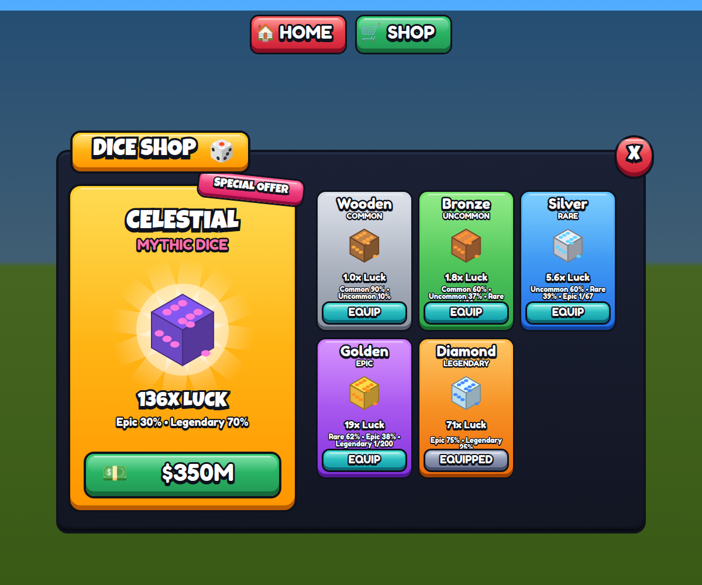

# 3D Cartoon Dice Shop UI

`tools/Build3DCartoonShop.luau` is a Studio Command Bar script. It builds a
thick-outline "3D" cartoon Dice Shop (HOME / SHOP top bar, featured card,
scrolling grid) from Roblox UI instances only, so there are no images to
upload. The look follows the popular Figma "depth" style: saturated
gradients, a darker extruded base under every face, a thick dark outline, a
glossy top and rim light, and text with a dark offset copy behind it.



*The mock-up is an HTML rendering of the same layout, sizes and colours, not a
Roblox screenshot. The dice are drawn flat here; in Roblox they're spinning 3D
models.*

## Install

1. Open **View → Command Bar** in Studio (Edit mode), paste all of
   `tools/Build3DCartoonShop.luau`, and press Enter.
2. Press **Play** and click **SHOP**.
3. Once you've switched over, delete your old Home/Shop buttons and Dice Shop.
   To keep your own top bar instead, set `BUILD_TOP_BAR = false` in the
   builder.

Re-running the builder replaces the whole GUI (Ctrl+Z undoes it), so make
lasting edits in the builder's config (`DICE`, colours, fonts) rather than by
hand.

## What it builds

```
StarterGui
└── 3DCartoonShopGui            ScreenGui
    ├── Dim                      dark backdrop; clicking it closes the shop
    ├── ShopWindow               UIScale (pop-in, fit to screen) + UISizeConstraint 700x420 to 1000x640
    │   ├── Base / Face          the window stands on a darker base
    │   │   └── Body
    │   │       ├── Featured     Card_Celestial: badge, spinning dice, luck, odds, price button
    │   │       └── Grid         ScrollingFrame + UIGridLayout of 160x236 cards (Card_Wooden, ...)
    │   ├── Header               gold "DICE SHOP" tab on the top edge
    │   └── CloseButton          round red X
    ├── TopBar                   HomeButton, ShopButton
    ├── ShopAction               BindableEvent (itemId, "Buy" | "Equip")
    ├── HomePressed              BindableEvent
    └── ShopController           LocalScript (copy of src/StarterGui/3DCartoonShopGui/ShopController.client.luau)
```

### How a 3D button is built

```
<Button>    TextButton hit area; attributes Button3D, Depth, PressDepth, Action
└── Visual  UICorner + UIStroke (the outline wraps face and base together) + UIScale
    ├── Base  darker colour, full height: the extrusion
    └── Face  height minus Depth; vertical UIGradient, Gloss, Rim, Label (+ Icon)
```

- **Hover:** Visual's UIScale tweens to 1.03.
- **Press:** Face slides down onto Base. Visual shrinks from the top by the
  same amount, so the outline keeps hugging the button.
- **Keyboard and gamepad:** a press plays a quick press-and-release.

## Connecting it to your game

From any LocalScript:

```lua
local Players = game:GetService("Players")
local shopGui = Players.LocalPlayer.PlayerGui:WaitForChild("3DCartoonShopGui")

-- Buy / Equip clicks
shopGui.ShopAction.Event:Connect(function(itemId, action)
	diceShopRemote:FireServer(itemId, action) -- keep prices and ownership on the server
end)
-- Server side: bind the handler with AntiCheat.bindRemote("DiceShop", ...);
-- see anti-cheat.md.

-- Show what the player owns. "Buy" shows the card's Price attribute;
-- setting one card to "Equipped" switches the previous one back to "Equip".
local function setDiceState(itemId, state)
	shopGui:FindFirstChild("Card_" .. itemId, true):SetAttribute("State", state)
end

shopGui:SetAttribute("Open", true) -- open or close from code
shopGui.HomePressed.Event:Connect(teleportHome)
```

## Tweaking

- **Dice:** edit the `DICE` table in the builder (name, rarity, luck, odds,
  state, price, colours, material). The entry with `featured = true` gets the
  big gold card.
- **Colours:** set with `GOLD`, `GREEN`, `RED`, `PINK`, `RARITIES` and
  `STATE_STYLES`. If you change `STATE_STYLES`, change the controller's copy
  too.
- **Fonts:** `TITLE_FONT` (Luckiest Guy) and `BODY_FONT` (Fredoka One).
- **Phones:** the window keeps a 700x420 minimum layout, and the controller
  scales it down to fit smaller screens.
